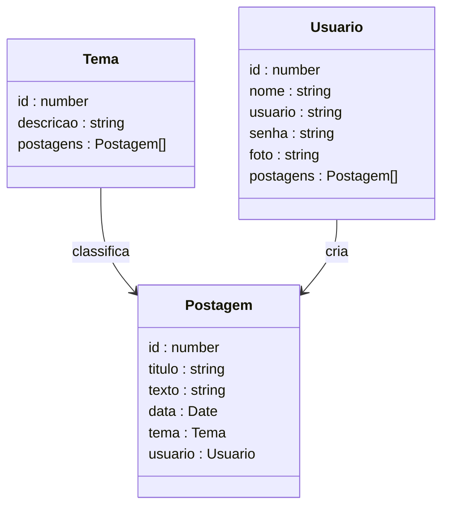
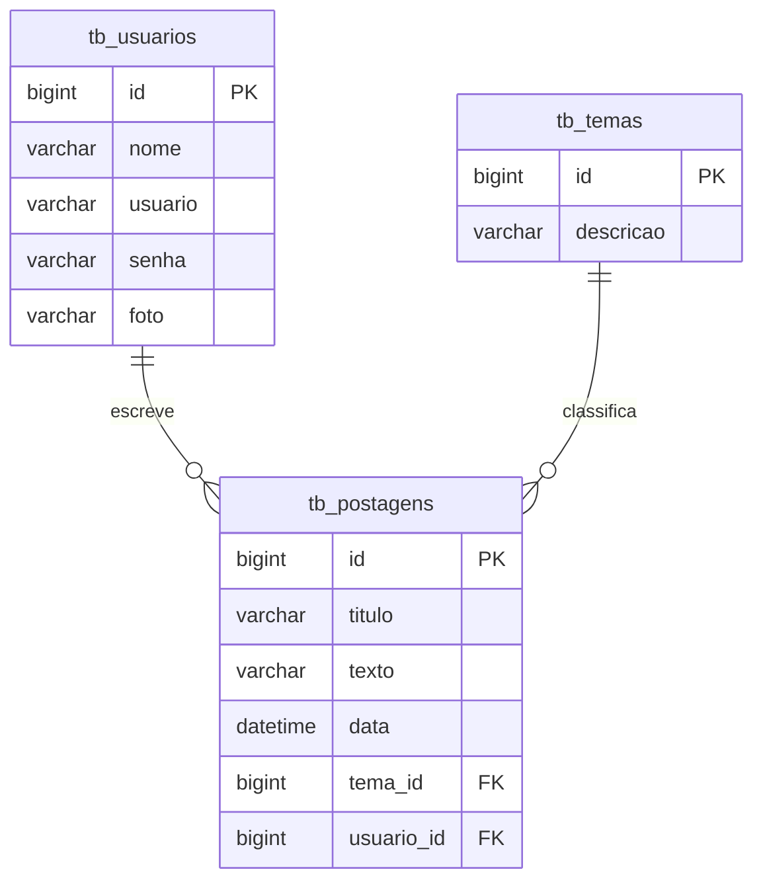

# Projeto Blog Pessoal — Backend com NestJS

<br />

<div align="center">
     
</div>


<br />

<div align="center">
  
  
  
  
  
  
  

</div>

<br />

## Descrição


O **Blog Pessoal** é uma API backend que permite que usuários publiquem, editem e visualizem postagens relacionadas a diferentes temas de forma organizada e segura.

O projeto foi desenvolvido com fins educacionais, simulando uma aplicação real utilizada em ambientes profissionais, com foco na construção de **APIs REST escaláveis utilizando NestJS e TypeScript**.

Entre os principais recursos disponíveis:

1. Criação, edição e exclusão de postagens
2. Associação de postagens a temas específicos
3. Cadastro e autenticação de usuários
4. Consulta de postagens por tema ou usuário
5. Controle de acesso em operações protegidas

------

## Sobre esta API


A API foi desenvolvida utilizando **Node.js**, **NestJS** e **TypeScript**, seguindo princípios de:

- Arquitetura modular
- Separação de responsabilidades
- Padrão REST
- Boas práticas de organização de código backend

A aplicação disponibiliza endpoints para gerenciamento dos recursos:

- **Usuário**
- **Postagem**
- **Tema**

permitindo a interação entre usuários e conteúdos publicados.

------

### Principais funcionalidades da API


1. Cadastro, autenticação e atualização de usuários
2. Gerenciamento de temas para classificação das postagens
3. Criação, edição, listagem e exclusão de postagens
4. Relacionamento entre postagens, autores e temas
5. Autenticação baseada em **JWT** para proteção das rotas

------

## Diagrama de Classes


O diagrama abaixo representa a estrutura lógica das entidades da aplicação e seus relacionamentos dentro da API.



------

## Diagrama Entidade-Relacionamento (DER)


O DER representa como os dados estão organizados no banco relacional e como as entidades se relacionam.



------

## Tecnologias Utilizadas


| Item               | Descrição                         |
| ------------------ | --------------------------------- |
| **Runtime**        | Node.js                           |
| **Linguagem**      | TypeScript                        |
| **Framework**      | NestJS                            |
| **Arquitetura**    | Modular + REST                    |
| **ORM**            | TypeORM                           |
| **Banco de Dados** | MySQL                             |
| **Autenticação**   | Passport                          |
| **Validação**      | class-validator + class-transform |
| **Documentação**   | Swagger (OpenAPI)                 |
| **Testes**         | Jest + Super Test                 |

------

## Arquitetura do Projeto


O projeto foi desenvolvido utilizando a arquitetura modular proposta pelo **NestJS**, promovendo organização, escalabilidade e facilidade de manutenção do código.

Cada domínio da aplicação é isolado em um módulo próprio, contendo suas responsabilidades bem definidas:

* **Controller** → recebe e trata requisições HTTP
* **Service** → contém as regras de negócio
* **Entity** → representa as tabelas do banco de dados
* **Repository/ORM** → comunicação com o banco (via TypeORM)

Essa separação facilita testes, evolução do sistema e reutilização de código.

---

## Estrutura de Pastas


A organização segue o padrão recomendado pelo NestJS:

```bash
📦src
 ┣ 📂auth
 ┣ 📂data
 ┣ 📂postagem
 ┣ 📂tema
 ┣ 📂usuario
 ┣ 📂util
 ┣ 📜app.controller.ts
 ┣ 📜app.module.ts
 ┣ 📜app.service.ts
 ┗ 📜main.ts
```

### Organização por módulo

Exemplo:

```bash
📦usuario
 ┣ 📂controllers
 ┃ ┗ 📜usuario.controller.ts
 ┣ 📂entities
 ┃ ┗ 📜usuario.entity.ts
 ┣ 📂services
 ┃ ┗ 📜usuario.service.ts
 ┗ 📜usuario.module.ts
```

Esse padrão permite crescimento do sistema sem acoplamento excessivo entre funcionalidades.

---

## Fluxo de Autenticação (JWT)


A autenticação da API utiliza **JSON Web Token (JWT)** para proteger rotas sensíveis.

### Fluxo geral:

1. O usuário realiza login informando credenciais
2. A API valida os dados
3. Um token JWT é gerado
4. O cliente envia o token no header das próximas requisições:

```http
Authorization: Bearer TOKEN
```

5. Os Guards do NestJS validam o token antes de permitir acesso às rotas protegidas.

Esse modelo é amplamente utilizado em aplicações modernas por ser:

* Stateless
* Escalável
* Compatível com APIs REST

---

## Validação de Dados


A aplicação utiliza:

* `class-validator`
* `class-transformer`

para garantir integridade dos dados recebidos pela API.

Exemplo conceitual:

* Campos obrigatórios são verificados automaticamente
* Tipos inválidos são rejeitados antes da regra de negócio
* Respostas de erro seguem padrão HTTP

Isso reduz erros e aumenta a confiabilidade da API.

---

## Boas Práticas Aplicadas


Durante o desenvolvimento foram aplicados conceitos utilizados em projetos reais:

* Organização modular do NestJS
* Separação entre controller e regras de negócio
* Tipagem forte com TypeScript
* Padronização REST
* Autenticação baseada em token
* Estrutura preparada para escalabilidade

---

## Diferenciais Técnicos


Este projeto demonstra competências importantes para desenvolvimento backend moderno:

✅ Construção de API REST com NestJS
✅ Arquitetura modular escalável
✅ Autenticação JWT
✅ Modelagem relacional (Usuário → Postagem → Tema)
✅ Integração com banco de dados MySQL via ORM
✅ Validação automática de dados
✅ Documentação interativa com Swagger
✅ Uso profissional de TypeScript no backend

---

## Requisitos


Para executar o projeto localmente:

- Node.js 18+
- npm
- MySQL
- Insomnia

------

## Como Executar o Projeto


### Clonando o repositório

```bash
git clone https://github.com/rafaelq80/blogpessoal_nest_tjs13.git
cd blogpessoal_nest_tjs13
```

------

### Instalando as dependências

```bash
npm install
```

------

### Configurando variáveis de ambiente

Crie um arquivo `.env` na raiz do projeto:

```env
DB_HOST=localhost
DB_PORT=3306
DB_USERNAME=root
DB_PASSWORD=root
DB_DATABASE=db_blogpessoal

JWT_SECRET=secret
```

------

### Executando a aplicação

```bash
npm run start:dev
```

A API será iniciada em:

```
http://localhost:4000
```

------

### Documentação da API

Após iniciar o projeto, acesse:

```
http://localhost:4000
```

O Swagger permitirá:

- visualizar endpoints
- testar requisições
- consultar modelos de dados

------

## Executando os Testes


Para rodar os testes automatizados:

```bash
npm run test
```

------

## Implementações Futuras


* Paginação de resultados
* Upload de imagens para usuários e postagens
* Sistema de comentários
* Refresh Token

------

## Contribuição


Sugestões, melhorias e pull requests são bem-vindos.

Você pode contribuir com:

- Melhorias arquiteturais
- Refatorações
- Testes automatizados
- Documentação

------

## Licença


Este projeto está sob licença **MIT** — livre para uso educacional e profissional.

------

## Autor


**Rafael — Desenvolvedor Full Stack & Instrutor**

🔗 **GitHub:** https://github.com/rafaelq80

🔗 **LinkedIn:** https://www.linkedin.com/in/rafaelq80

Projeto desenvolvido para **aprendizado contínuo**, **demonstração técnica** e **portfólio profissional**.