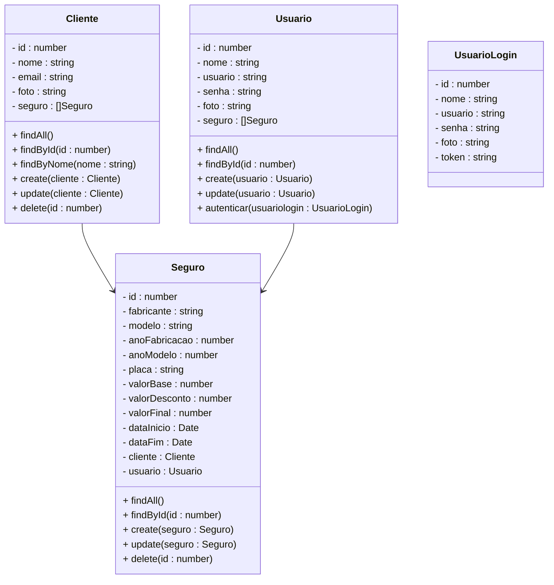

# Projeto Gerenciador de Seguros Automotivos - Backend

<br />

<div align="center">
    
</div>

<br /><br />

## 1. Descrição

Um **Sistema de Gerenciamento de Seguros Automotivos** é uma solução utilizada por seguradoras ou corretoras para **organizar, registrar e acompanhar contratos de seguros de veículos**. Esse tipo de sistema permite centralizar informações importantes como clientes, veículos segurados e apólices, facilitando o controle das operações e a tomada de decisões.

O objetivo principal de um sistema de gestão de seguros é **automatizar processos administrativos**, melhorar o controle das apólices e proporcionar maior eficiência no atendimento ao cliente.

Entre os principais benefícios de um sistema desse tipo, destacam-se:

1. **Centralização das informações** de clientes, veículos e seguros
2. **Facilidade na gestão de apólices** e contratos
3. **Automação de processos administrativos**
4. **Melhor acompanhamento de status e vigência dos seguros**

Esses sistemas normalmente são disponibilizados por meio de **plataformas web**, permitindo que operadores cadastrem clientes, registrem veículos segurados e gerenciem contratos de seguro de forma prática e segura.

------

# 2. Sobre esta API

Neste projeto será desenvolvido um **Mínimo Produto Viável (MVP)** de um **Sistema de Gerenciamento de Seguros Automotivos**, implementando as operações **CRUD (Create, Read, Update, Delete)** para os principais registros de um sistema desse tipo.

A API foi desenvolvida utilizando **NestJS e TypeScript**, sendo responsável por disponibilizar os endpoints que permitem a manipulação dos dados do sistema.

A solução contempla três entidades principais:

### 1. **Usuários**

Representam os operadores do sistema, como funcionários da seguradora ou corretores responsáveis por gerenciar clientes e seguros.

**Exemplo:**
João trabalha em uma corretora de seguros e utiliza o sistema para cadastrar clientes e registrar apólices de seguros de veículos.

------

### 2. **Clientes**

Representam as pessoas que contratam seguros para seus veículos.

**Exemplo:**
Maria possui um automóvel e contratou um seguro. Seus dados foram cadastrados no sistema para facilitar o gerenciamento da apólice.

------

### 3. **Apólices (Seguros)**

Representam os **contratos de seguro associados a um cliente e a um veículo**. Nelas são armazenadas informações como tipo de cobertura, data de vigência, valor do seguro e status da apólice.

**Exemplo:**
Maria contratou um seguro para seu carro. O sistema registra essa contratação como uma **Apólice**, vinculada ao cliente e ao veículo.

------

## 2.1 Exemplo Prático – Fluxo no Sistema

1. O **Usuário** cadastra um **Cliente** no sistema.
2. O usuário registra uma **Apólice de Seguro**, associando o cliente ao veículo segurado.

------

## 2.2 Principais Funcionalidades

1. Cadastro e gerenciamento de usuários do sistema
2. Registro e gerenciamento de clientes
3. Cadastro e gerenciamento de apólices de seguro

------

# 3. Diagrama de Classes



### Observações Importantes

- O preço do seguro é calculado automaticamente
- Automóveis com mais de 10 anos, recebem um desconto de 20%

------

# 4. Diagrama Entidade-Relacionamento (DER)

------

<div align="center">
    
</div>

# 5. Tecnologias utilizadas

| Item                          | Descrição  |
| ----------------------------- | ---------- |
| **Servidor**                  | Node.js    |
| **Linguagem de programação**  | TypeScript |
| **Framework**                 | NestJS     |
| **ORM**                       | TypeORM    |
| **Banco de dados Relacional** | MySQL      |

------

# 6. Configuração e Execução

1. Clone o repositório
2. Instale as dependências:

```
npm install
```

1. Configure o banco de dados no arquivo `app.module.ts`
2. Execute a aplicação:

```
npm run start:dev
```

A API será iniciada em ambiente de desenvolvimento e ficará disponível para consumo por aplicações frontend, como o **Gerenciador de Seguros Automotivos desenvolvido em React**.